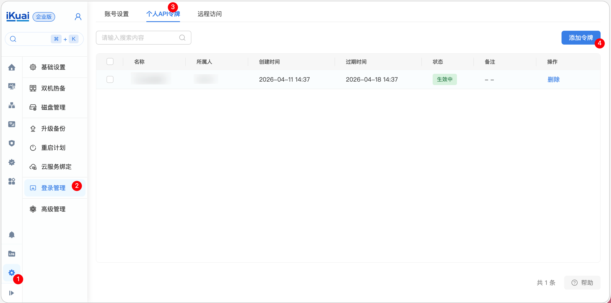

# ikuai-cli

[](https://github.com/ikuaidev/ikuai-cli/actions/workflows/ci.yml)
[](https://github.com/ikuaidev/ikuai-cli/releases)
[](go.mod)
[](https://goreportcard.com/report/github.com/ikuaidev/ikuai-cli)
[](LICENSE)

A CLI for iKuai routers — manage network, users, VPN, firewall and more from the terminal.

[中文文档](README_CN.md)

## Installation

**macOS / Linux:**

```bash
curl -fsSL https://raw.githubusercontent.com/ikuaidev/ikuai-cli/main/scripts/install.sh | sh
```

**Go install:**

```bash
go install github.com/ikuaidev/ikuai-cli/cmd/ikuai-cli@latest
```

<details>
<summary>Other install methods</summary>

**Pre-built binary:** download from [GitHub Releases](https://github.com/ikuaidev/ikuai-cli/releases).

```bash
VERSION=0.1.0 ARCH=linux_amd64
curl -fsSL "https://github.com/ikuaidev/ikuai-cli/releases/download/v${VERSION}/ikuai-cli_${ARCH}.tar.gz" -o ikuai-cli.tar.gz
curl -fsSL "https://github.com/ikuaidev/ikuai-cli/releases/download/v${VERSION}/checksums.txt" -o checksums.txt
sha256sum --check --ignore-missing checksums.txt
tar -xzf ikuai-cli.tar.gz
sudo mv ikuai-cli /usr/local/bin/
```

Windows: download `ikuai-cli_windows_amd64.zip` from [Releases](https://github.com/ikuaidev/ikuai-cli/releases).

**Build from source:**

```bash
git clone https://github.com/ikuaidev/ikuai-cli.git
cd ikuai-cli
make build
```

**Shell completion:**

```bash
ikuai-cli completion bash > ~/.local/share/bash-completion/completions/ikuai-cli
ikuai-cli completion zsh  > ~/.zsh/completions/_ikuai-cli
ikuai-cli completion fish > ~/.config/fish/completions/ikuai-cli.fish
ikuai-cli completion powershell > ikuai-cli.ps1
```

</details>

## How to Get a Token from the Router



## Quick Start

### 1. Authenticate

**Option A: Environment variables** (recommended for scripts & agents)

```bash
export IKUAI_CLI_BASE_URL=https://192.168.1.1
export IKUAI_CLI_TOKEN=<your-token>
ikuai-cli monitor system   # works immediately
```

**Option B: Persistent session** (saved to `~/.ikuai-cli/config.json`)

```bash
ikuai-cli auth set-url https://192.168.1.1
ikuai-cli auth set-token <your-token>
```

### 2. Verify

```bash
ikuai-cli auth status
```

### 3. Explore

```bash
ikuai-cli monitor system                     # CPU, memory, uptime, WAN IP
ikuai-cli network dns get                    # DNS config
ikuai-cli network dns proxy create --domain example.com --dns-addr 8.8.8.8 --parse-type ipv4
ikuai-cli network pppoe set --comment maintenance --mtu 1480 --mru 1480
ikuai-cli users online                       # Online users
ikuai-cli security acl list                  # Security rules
ikuai-cli log system list --human-time       # System logs
```

> Full command reference: [docs/cli-reference.md](docs/cli-reference.md)

## Features

- **Network** — DNS, DHCP, VLAN, NAT, PPPoE, interfaces
- **Monitor** — CPU, memory, uptime, traffic, online clients
- **Security** — ACL, MAC filtering, L7 rules, URL filtering, domain blacklist, peerconn, terminals
- **Users** — auth accounts, online sessions, kick, auth packages, bandwidth limits
- **Routing** — static routes, policy routing, multi-WAN
- **VPN** — PPTP, L2TP, OpenVPN, IKEv2, IPSec, WireGuard
- **Objects** — IP, IPv6, MAC, port, protocol, domain, time object groups
- **Wireless** — Wi-Fi configuration and management
- **QoS** — bandwidth control and traffic shaping
- **System** — config, schedules, remote access, VRRP, backup, upgrade, web admin
- **Log** — system logs and audit trails
- **Interactive shell** — `repl` mode with multi-level tab completion
- **Structured output** — table by default; `--format json/yaml` or `--raw` for machines; `--human-time` for timestamps; `--wide` / `--columns` for column control

## Output

Default output is a human-readable table. When stdout is not a TTY (piped or redirected), output automatically switches to JSON.

List commands show a curated set of default columns in table mode. Use `--wide` to see all fields, or `--columns` to pick specific ones. Columns auto-fit to your terminal width.

```bash
ikuai-cli monitor system                     # Table (human)
ikuai-cli monitor system --format json       # JSON (scripts, jq, agents)
ikuai-cli monitor system --format yaml       # YAML
ikuai-cli monitor system --raw               # Full API envelope (debug)
ikuai-cli log system list --human-time       # Human-readable timestamps
ikuai-cli security acl list --wide           # Show all columns
ikuai-cli security acl list --columns id,src_addr,action  # Custom columns
```

> `--raw` and `--format` are mutually exclusive. `--wide` and `--columns` are mutually exclusive.

## Session Storage

Credentials are saved to `~/.ikuai-cli/config.json`. Override with:

```bash
export IKUAI_CLI_CONFIG_FILE=/path/to/config.json
```

**Priority:** session file > environment variables > none.

Environment variables (`IKUAI_CLI_BASE_URL` / `IKUAI_CLI_TOKEN`) are never written to disk.

## Use with AI Agents

ikuai-cli ships with a [`SKILL.md`](./SKILL.md) and domain-specific [skills](./skills/) that teach AI agents how to manage iKuai routers.

| Skill | Description |
|-------|-------------|
| [monitor](skills/monitor.md) | System status, CPU, memory, traffic, online clients |
| [network](skills/network.md) | DNS, DHCP, VLAN, NAT/DNAT, WAN, LAN, PPPoE, DMZ, DNS proxy |
| [users](skills/users.md) | Online users, kick by ID, accounts, packages |
| [security](skills/security.md) | ACL, MAC filter, L7, URL filter, domain blacklist, peerconn, terminals |
| [vpn](skills/vpn.md) | PPTP, L2TP, OpenVPN, IKEv2, IPSec, WireGuard |
| [objects](skills/objects.md) | IP, IPv6, MAC, port, protocol, domain, time object groups |
| [system](skills/system.md) | Config, schedules, remote access, VRRP, backup, upgrade, web admin |
| [auth-server](skills/auth-server.md) | Web authentication service config |
| [batch](skills/batch.md) | Multi-command workflows: init, bulk DHCP, backup |

### Install Skills

**[Skills CLI](https://github.com/vercel-labs/skills) (Recommended):**

```bash
npx skills add ikuai/ikuai-cli
```

| Flag | Description |
|------|-------------|
| `-g` | Install globally (user-level, shared across projects) |
| `-a claude-code` | Target a specific agent |
| `-y` | Non-interactive mode |

**Manual:**

```bash
mkdir -p .agents/skills
git clone https://github.com/ikuaidev/ikuai-cli.git .agents/skills/ikuai-cli
```

### Agent Output

Use `--format json` for structured output:

```bash
ikuai-cli monitor system --format json
ikuai-cli users online --format json | jq '.data[] | {id, ip_addr, mac, username}'
```

Use `--format yaml` for token-efficient output when full JSON fidelity is not required.

## Development

```bash
git clone https://github.com/ikuaidev/ikuai-cli.git
cd ikuai-cli
make test       # run all tests (with race detector)
make lint       # golangci-lint
make build      # build binary
make smoke      # smoke test
```

Cross-compile:

```bash
make linux-amd64    make linux-arm64
make darwin-amd64   make darwin-arm64
```

## Community

- [Issues](https://github.com/ikuaidev/ikuai-cli/issues) — bug reports and feature requests
- [Contributing](CONTRIBUTING.md) — how to contribute
- [Security](SECURITY.md) — how to report vulnerabilities
- [Code of Conduct](CODE_OF_CONDUCT.md)

## License

MIT — see [LICENSE](LICENSE)
